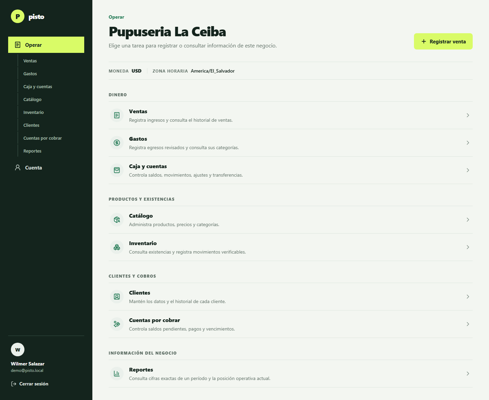
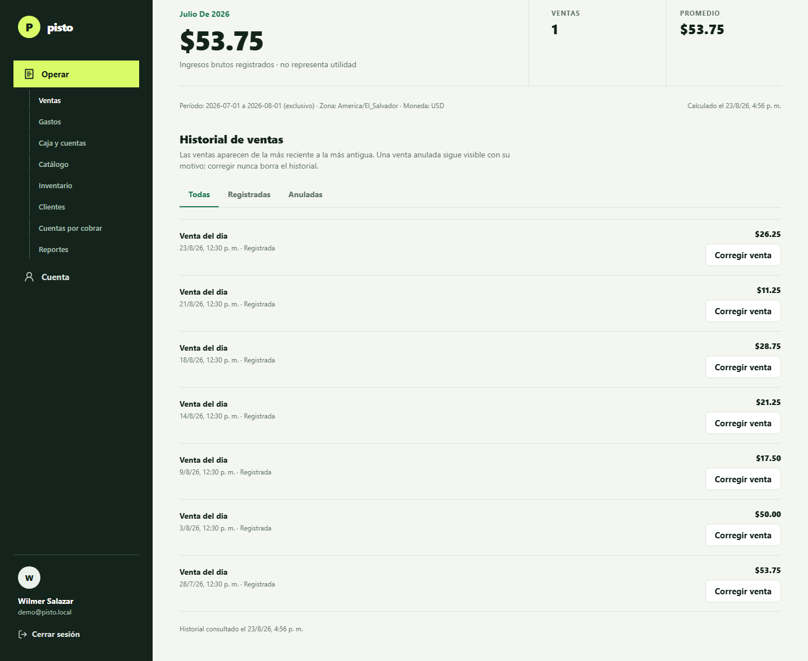
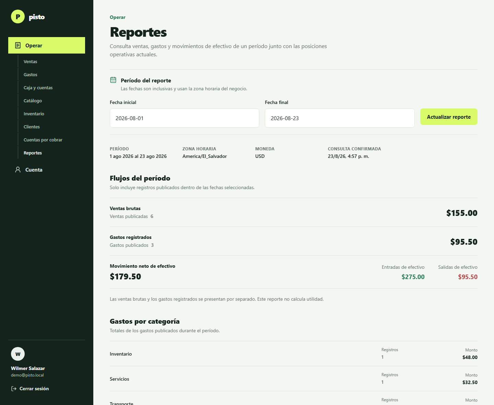
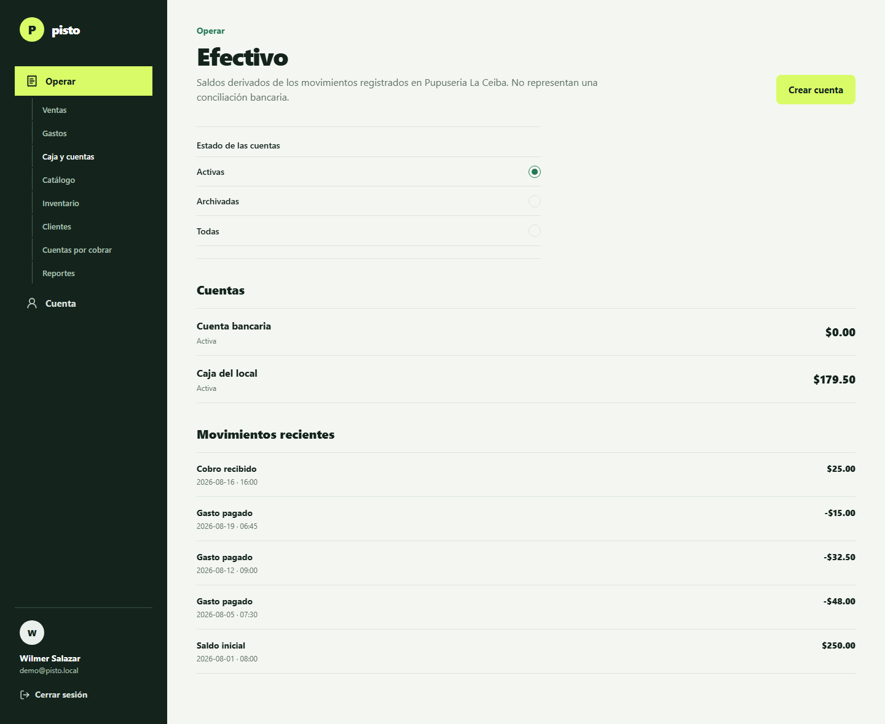
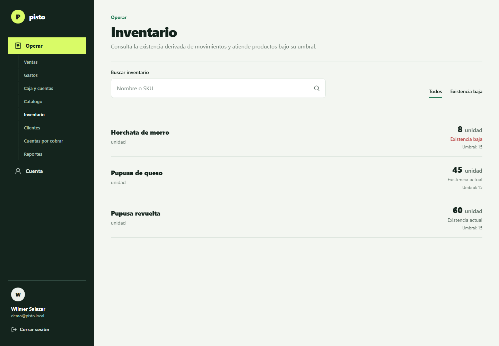
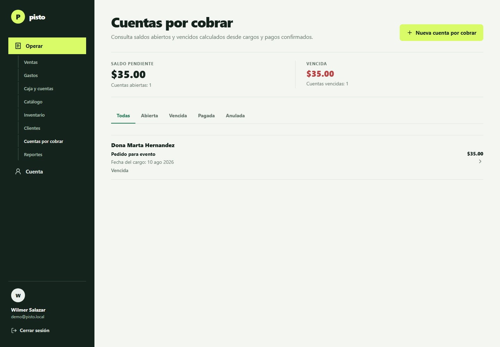
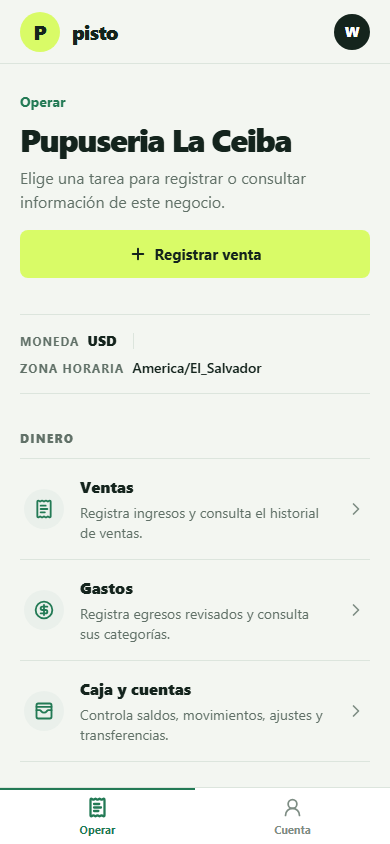
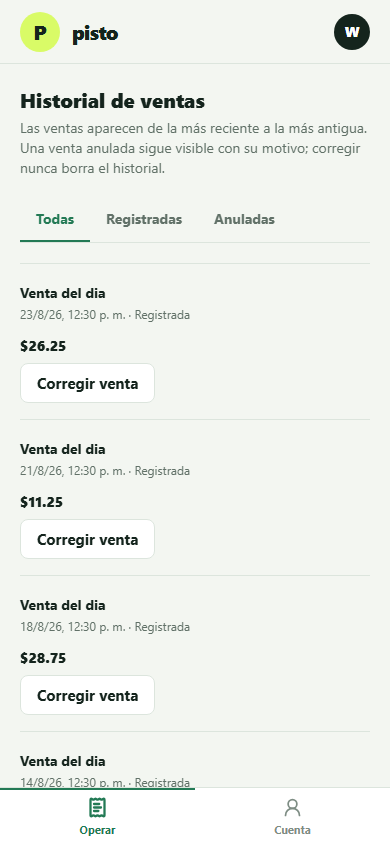
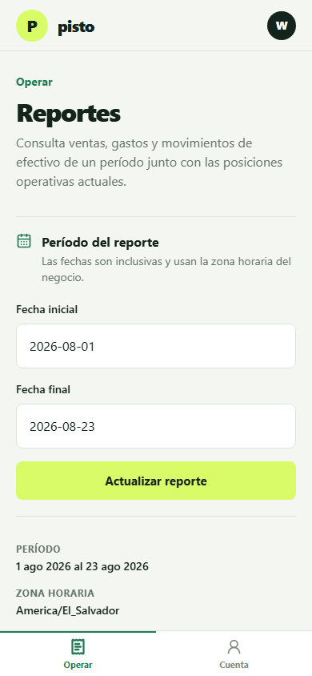

# Pisto Stack

Pisto Stack is a production-oriented starter for one TypeScript product across iOS,
Android, and the web. It combines an Expo Router application with a Bun/Hono API,
PostgreSQL and Drizzle, Better Auth, provider-neutral entitlements, web billing through
Polar, and native purchase boundaries for the Apple App Store and Google Play.

The repository is intentionally built from source instead of cloned from another starter.
Every integration is replaceable behind a small package boundary.
"Built from source" means the repository composition is owned here; it is not a rule to reimplement
mature platform or library capabilities.

The active product direction is an AI-native operating assistant for Spanish-speaking entrepreneurs.
What exists today is the structured manual path: sales with void/replacement correction, catalog,
inventory movements, expenses, cash accounts and movements, and customers and receivables, all
reachable from an `/operate` module hub. No AI dependency is installed in any manifest, so there is
no conversational or voice sale path yet, and `/dashboard` is only a redirect into `/operate`. Start
with [the documentation map](docs/README.md) and the
[product capability architecture](docs/product-capability-architecture.md) before adding a module or
changing navigation.

## What it looks like

Captured from a local development build against PostgreSQL, with a seeded demo business.
Interface copy is the typed `es-SV` catalog. These images are refreshed by hand and can lag the
code; the tests and `docs/production-capabilities.md` remain the authoritative statement of what
works.

### Wide web

| Operate hub | Sale history with correction |
| --- | --- |
|  |  |

| Exact operating report | Cash accounts and movements |
| --- | --- |
|  |  |

| Inventory stock | Customer receivables |
| --- | --- |
|  |  |

### Compact web, at 390 CSS pixels

| Operate hub | Sale history | Operating report |
| --- | --- | --- |
|  |  |  |

The same routes render on iOS and Android from this codebase. No screenshot here is from a physical
device, so nothing on this page is evidence of native behavior.

## Repository map

- apps/app: universal Expo application and platform-specific adapters
- apps/api: Bun/Hono HTTP service
- packages/contracts: shared request, response, and error schemas
- packages/db: PostgreSQL schema, migrations, and repositories
- packages/auth: Better Auth server configuration
- packages/billing: Polar adapter and canonical entitlements
- scripts: safe setup and diagnostic CLI
- docs: architecture, setup, operations, security, and source links
- .agents/skills: repository-scoped Codex workflow for architecture-first product delivery
- infra/gcp: Cloud Build and Cloud Run deployment reference

## Quick start

Requirements: Bun 1.4+, Node.js 24.19 LTS, Docker Desktop, and the Expo prerequisites for
the target platform.

1. Run bun install.
2. Run bun run setup.
3. Run docker compose up -d postgres.
4. Run bun run db:migrate.
5. Run bun run dev.

The setup command creates missing local environment files without overwriting existing
ones. Run bun run doctor whenever a local tool or service appears misconfigured.

## Validation

- bun run check validates formatting, lint rules, types, tests, and the Expo web export.
- bun run build builds all packages and applications.
- bun run verify adds environment diagnostics before the full validation.

Start with docs/README.md for the active product goal, engineering workflow, complete guide, and
primary-source references. Codex agents also load the root AGENTS.md and the repository-scoped skill
under `.agents/skills`.

## Billing boundary

Polar is the default checkout and customer portal for browser purchases. Native apps must
use Apple StoreKit or Google Play Billing for in-app digital goods where store rules apply.
Both paths write into the same internal entitlement model, so product code never trusts a
provider response directly.

## License

No license has been selected. Add one before distributing the template outside your team.
