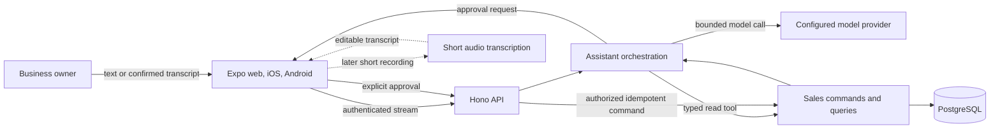

# AI assistant architecture

- Status: **accepted target architecture; not implemented**
- Research date: **2026-08-22**
- Recheck trigger: AI SDK, Expo, Bun, model provider, voice, retrieval, privacy, or deployment change

## Decision summary

Pisto will use the current stable Vercel AI SDK 7 family as a thin server-side orchestration layer for
streaming, typed tools, structured output, approvals, transcription, and provider adapters. The exact
patch and first provider package are selected and pinned only after the implementation spike validates
the current APIs against Bun, Hono, Cloud Run, Expo web, iOS, and Android.

PostgreSQL remains the only authoritative business datastore. The assistant calls narrow Pisto-owned
commands and queries. It never owns accounting rules, executes arbitrary SQL, trusts generated totals,
or writes directly from unvalidated model output.

Start with text and short request-bound interactions. Add push-to-talk transcription after the text
sale flow is useful and safe. Do not add Redis stream resumption, durable workflow agents, RAG,
pgvector, Neo4j, GraphRAG, or realtime voice without the evidence gates in this guide.

## Planned flow

The model can propose or select a tool. Only deterministic code can authorize, calculate, and commit
the operation.

## Planned ownership

No new package in this section exists yet. Create it only with the first approved implementation.

| Owner | Responsibility | Prohibited ownership |
| --- | --- | --- |
| `apps/app` | Conversation UI, approval surface, stream state, short-recording adapter | Provider keys, prompts, business authorization |
| `apps/api` | HTTP/stream composition, auth resolution, rate and size limits | Generated business rules or provider-specific domain types |
| `packages/contracts` | Pisto-owned public turn, draft, approval, result, and error schemas | Raw provider responses or database rows |
| future `packages/sales` | Sale invariants, money calculations, commands, queries, audit policy | AI SDK, Hono, React, or provider clients |
| `packages/db` | Drizzle schema, migrations, and repositories | Prompts, tool selection, or UI state |
| future `packages/assistant` | AI SDK configuration, prompt versions, tool registry, bounded orchestration | SQL, canonical financial calculations, or authorization policy |

The API is the composition root. The assistant package receives authorized product capabilities; the
product domain does not depend on the assistant.

## Provider and model boundary

- Use AI SDK 7 Core on the server. Do not put model or transcription credentials in Expo.
- Start with one direct provider adapter that passes Pisto's Spanish financial-intent evaluation.
  Installing every provider package in advance adds cost without portability.
- Keep one validated server-side registry of stable task aliases such as `assistant.primary` and
  `transcription.primary`. Product code does not scatter provider or model IDs.
- Vercel AI Gateway is an optional provider adapter, not a requirement of using AI SDK. Selecting it
  requires a documented data path, credentials, cost controls, regional/privacy review, and an ADR
  amendment.
- A provider/model change is a release change. Run the same extraction, tool-selection, refusal,
  latency, and cost evaluations before promotion.
- Provider-specific options stay at the external adapter edge. A feature cannot depend silently on a
  provider-only tool or message shape.
- Do not silently fail over. An approved fallback must have equivalent required capabilities, an
  observable activation reason, bounded retry behavior, privacy review, evaluation evidence, and no
  chance of replaying a financial mutation.
- If the provider is unavailable, show a degraded assistant state and preserve structured product
  screens. Do not return a canned answer or pretend the write succeeded.

## Tool model

Use a small static tool set with Zod schemas and server-owned execution.

### Read tools

Read tools may execute automatically after authentication and authorization. Examples include a
bounded sales summary or sale lookup. They return domain-shaped facts, period/scope metadata, and data
freshness. They never expose SQL, unrestricted filters, another tenant, or raw persistence rows.

### Mutation tools

Financial mutations use AI SDK 7 call-level approval policy or an equivalently strong Pisto-owned
draft/confirmation protocol. The implementation must bind the approval to the original typed inputs,
authenticated subject, business, expiry, and idempotency key. HMAC-hardened approval is preferred when
the selected AI SDK flow supports it.

Approval is not authorization. On continuation, the server reloads current membership and state,
revalidates the complete command, recomputes money, applies domain rules, and commits transactionally.

Do not expose arbitrary SQL, shell, filesystem, generic HTTP, billing-provider, entitlement-mutation,
role-management, or tool-discovery capabilities to the product model.

## Conversation and canonical data

- Persist server-generated conversation and message IDs only when the product needs history.
- Scope every conversation to the authenticated user and business.
- Validate loaded UI messages before converting them to model messages.
- Store prompt version, model alias, completion state, token/cost metadata, and bounded tool audit data.
- Minimize or redact tool arguments/results that repeat sensitive business data.
- Do not enable telemetry recording of prompts or outputs by default.
- Define retention/export/deletion before production. Deleting a conversation does not delete its
  confirmed canonical sale; voiding a sale does not require retaining raw model text.
- Do not create automatic long-term "memory" from conversation. Business preferences become explicit
  validated settings with their own owner and audit path.

## Streaming and Expo compatibility gate

AI SDK documents Hono streaming and an Expo client path, but the current Hono example uses the Node
server adapter. Before adopting the package:

1. pin the exact AI SDK 7 and provider versions;
2. run `streamText` through Pisto's Bun Hono server and container;
3. validate credentials/cookies, headers, cancellation, disconnect, proxy buffering, timeouts, and
   structured errors;
4. exercise `@ai-sdk/react` with Expo 57 web, iOS, and Android using the documented stream headers and
   any still-required polyfills;
5. use Expo's standards-based `expo/fetch` streaming implementation where a custom transport is
   required; and
6. keep a narrow Pisto client transport boundary if AI SDK UI is not compatible on one target.

Do not add React Server Components or a Next.js-only route to the universal product. The assistant's
product contracts remain Pisto-owned even if the wire stream uses AI SDK UI parts.

Initially, persist completed turns and report an interrupted state after disconnect. Do not add Redis
and resumable-stream infrastructure until measured reconnect behavior justifies its security,
operational, abort, and race complexity.

## Execution bounds

The first assistant flow uses `streamText` or an explicit structured workflow, not an autonomous
general-purpose agent:

- no more than three or four model steps per turn;
- only the tools relevant to the current intent;
- explicit total, per-step, per-chunk, and per-tool timeouts;
- bounded provider retries only for safe reads or pre-effect idempotent operations;
- output-token, audio-size/duration, per-user, per-business, and environment cost limits;
- abort propagation from client through provider/tool execution; and
- a server kill switch that disables AI without disabling canonical product access.

Do not adopt `WorkflowAgent` or another durable agent runtime until a real operation must survive a
deployment, outlive one request, or wait for a long approval.

## Voice boundary

The first voice capability uses `expo-audio` and AI SDK 7's stable server-side transcription API after
the pinned provider is verified.

- Use a visible press-to-record control and request permission in context.
- Keep background recording disabled.
- Cap duration and bytes and allow only tested formats from web, iOS, and Android.
- Treat audio and transcripts as sensitive business data.
- Delete raw audio after transcription and a short documented retry window by default.
- Return editable text to the composer; do not submit or execute it automatically.
- Provide silence, permission-denied, unsupported-format, timeout, provider-error, cancellation, and
  offline states.

Realtime speech-to-speech remains experimental in AI SDK 7 and is not the first voice architecture.
Add it only after a measured hands-free or latency requirement justifies ephemeral-token, WebSocket,
interruption, privacy, provider-capability, and native-device work.

## Retrieval decision ladder

1. Use exact relational queries for sales, inventory, expenses, customers, balances, and reports.
2. Use PostgreSQL full-text search for names, descriptions, and notes when keyword search is needed.
3. Add pgvector for an approved unstructured corpus only when a labeled evaluation proves a material
   semantic-retrieval improvement. Keep tenant filters and source provenance in PostgreSQL, record the
   embedding provider/model/version, and define re-embedding and deletion propagation.
4. Add Neo4j only for proven variable-depth multi-hop graph questions that benchmark poorly in
   PostgreSQL and justify a second datastore, authorization projection, synchronization, backup,
   reconciliation, and operations model.
5. Add GraphRAG only when evaluated cross-document relationship questions justify both the graph and
   a separate Python ingestion runtime.

Approximate vector indexes trade recall for speed. Begin with exact search at small scale and add HNSW
only after corpus size and measured latency require it. Verify the actual pgvector version available
in the target Cloud SQL instance before relying on a feature.

## Testing and evaluation contract

- Unit-test orchestration with AI SDK mock language and embedding models; no provider call is needed.
- Test every tool schema, approval/denial, authorization, idempotency, timeout, cancellation, and
  duplicate continuation path.
- Run database integration tests for tenant isolation, money precision, transaction atomicity, audit,
  correction, and period boundaries in the business time zone.
- Maintain versioned Spanish evaluation cases for complete, incomplete, ambiguous, adversarial, and
  prompt-injected sale/report requests.
- A structured schema pass is not a semantic pass. Score exact extracted fields, clarification,
  correct tool choice, abstention, unsupported requests, and revenue-versus-profit language.
- Compare every provider/model candidate on the same dataset and record quality, latency, token usage,
  cost, and failure rate.
- Exercise streaming and recording on compact native, compact web, and wide web plus physical devices
  before release claims.

## Privacy and observability

Record safe operational metadata: request/turn ID, opaque user/business reference, model alias,
prompt version, tool name, approval outcome, latency, token counts, estimated cost, finish reason, and
bounded error code. Do not record raw prompts, transcripts, audio, model output, full tool arguments,
or canonical records in telemetry by default.

The provider data-use, retention, training, region, subprocessors, and deletion terms are a release
decision and must be reviewed against the exact selected account/product. Internet documentation does
not prove the configured account setting.

## Current capability state

| Capability | State |
| --- | --- |
| Product brief and target architecture | Approved and documented |
| AI SDK or provider dependency | Not installed |
| Assistant route, package, prompt, tools, UI, or schema | Not implemented |
| Sales/inventory/expense product data | Not implemented |
| Voice recording or transcription | Not implemented |
| Conversation persistence or long-term memory | Not implemented |
| RAG, embeddings, pgvector, Neo4j, or GraphRAG | Intentionally not selected |
| Provider sandbox/device/deployment evidence | None |

## Primary sources

- [Vercel AI SDK 7 release](https://vercel.com/changelog/ai-sdk-7)
- [AI SDK provider and model management](https://ai-sdk.dev/docs/ai-sdk-core/provider-management)
- [AI SDK tools and approvals](https://ai-sdk.dev/docs/ai-sdk-core/tools-and-tool-calling)
- [AI SDK loop control](https://ai-sdk.dev/docs/agents/loop-control)
- [AI SDK testing](https://ai-sdk.dev/docs/ai-sdk-core/testing)
- [AI SDK message persistence](https://ai-sdk.dev/docs/ai-sdk-ui/chatbot-message-persistence)
- [AI SDK Expo quickstart](https://ai-sdk.dev/docs/getting-started/expo)
- [AI SDK with Hono](https://ai-sdk.dev/cookbook/api-servers/hono)
- [Expo SDK 57 streaming fetch](https://docs.expo.dev/versions/v57.0.0/sdk/expo/)
- [Expo Audio](https://docs.expo.dev/versions/v57.0.0/sdk/audio/)
- [PostgreSQL full-text search](https://www.postgresql.org/docs/18/textsearch.html)
- [pgvector](https://github.com/pgvector/pgvector)
- [Neo4j graph database concepts](https://neo4j.com/docs/getting-started/graph-database/)
- [Neo4j GraphRAG requirements](https://neo4j.com/docs/neo4j-graphrag-python/current/)
