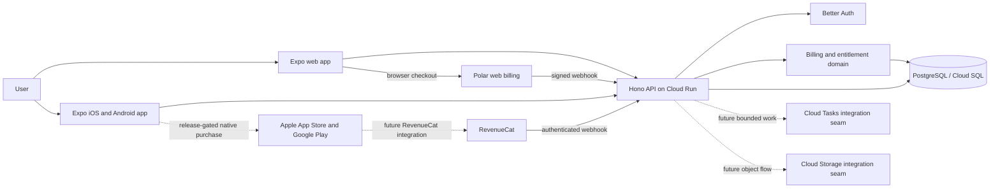

# Architecture

## Goals

Pisto Stack keeps one TypeScript codebase while preserving hard trust boundaries between a public
client, an internet-facing API, provider integrations, and durable data. The design favors explicit
contracts, small provider adapters, reversible releases, and access decisions that remain valid when
billing events are delayed or duplicated.

## Context diagram

The browser and native applications can show cached provider information for responsive UX, but the
API owns authorization. A client assertion such as `isPro: true` is never trusted.

## Workspace boundaries

| Workspace | Owns | Must not own |
| --- | --- | --- |
| `@pisto/app` | Expo Router screens, platform UI, public API client, device adapters | Provider secrets, SQL, server authorization |
| `@pisto/api` | Hono composition, middleware, route handlers, health endpoints | Database schema or provider-specific access rules |
| `@pisto/contracts` | Transport-neutral request/response schemas and public types | Runtime I/O or provider SDK clients |
| `@pisto/db` | Drizzle schema, migrations, repositories, transaction helpers | HTTP or UI concerns |
| `@pisto/auth` | Better Auth configuration, session access, auth schema integration | Product catalog or UI navigation |
| `@pisto/billing` | Provider adapters, webhook normalization, entitlement resolution | React components or HTTP framework composition |

Dependencies point inward toward contracts and domain packages. The API composes packages; packages
do not import the API. The app may import public contracts, but never server implementations.

## Core flows

### Authenticated API request

1. The client sends its Better Auth session using the platform-appropriate cookie mechanism.
2. Hono applies request ID, logging, secure headers, CORS, and body-size controls.
3. Better Auth resolves the session at `/api/auth/*` or an API auth guard resolves it for `/v1/*`.
4. The route validates input using shared contracts.
5. A repository performs bounded database work.
6. The API returns a typed response without internal exceptions, credentials, or provider payloads.

### Web purchase

1. An authenticated browser requests an allowed product from `/v1/billing/checkout`.
2. The server maps the internal product to an allowlisted Polar product and creates or selects a web
   checkout. The browser does not supply a trusted price or arbitrary product ID.
   Direct Better Auth provider checkout/customer paths are denied at the Hono edge; only the `/v1`
   wrappers invoke those adapter endpoints internally after subject/scope validation.
3. Polar completes payment in the browser.
4. A signed Polar webhook updates provider state idempotently.
5. The billing domain recomputes the internal entitlement and the current return screen refreshes
   `/v1/billing/entitlements`. `/v1/billing/state` remains available when a client also needs the
   normalized provider customer state.

### Native purchase (release-gated integration seam)

The baseline native adapter is disabled and the RevenueCat React Native SDK is not installed. Once
the native release gate in the billing documentation is complete, the intended flow is:

1. The native app requests offerings from RevenueCat and invokes Apple or Google native purchase UI.
2. RevenueCat validates store transactions and exposes active native entitlements.
3. The app immediately refreshes its UI from `CustomerInfo`, but server-controlled features still
   consult the API entitlement.
4. An authenticated RevenueCat webhook updates the backend projection. Restore uses the same stable,
   non-guessable application user ID as the authenticated Pisto user.

See [Billing and entitlements](billing-entitlements.md) for the normative rules and current policy
qualification.

### Asynchronous work and objects (integration seams)

No Cloud Tasks queue, task handler, user-file feature, or Cloud Storage bucket is included. When
those capabilities are added, the intended design is bounded idempotent work delivered to a private
Cloud Run handler with Google OIDC, and direct object transfer using short-lived narrowly scoped
signed URLs. API requests should not proxy large files unless a security requirement demands it.

## Runtime topology

- Local: Bun processes plus PostgreSQL 18 in Docker Compose.
- Target production API: one immutable Linux container revision on Cloud Run, listening on
  `0.0.0.0` and the injected `PORT`; the repository has reference configuration but no deployment
  evidence.
- Target production data: Cloud SQL for PostgreSQL, accessed through bounded connection pools; not
  provisioned by this repository.
- Target secrets: Secret Manager references attached to the Cloud Run revision; not provisioned by
  this repository.
- Included deployment reference: Cloud Build configures and waits for a one-task Cloud Run migration
  job with a distinct identity before API deployment; no successful cloud execution is claimed.
- Target background seam: Cloud Tasks with OIDC-authenticated HTTP targets; not provisioned here.
- Target object seam: private Cloud Storage with uniform access and signed URLs; not provisioned here.

The API remains stateless between requests. Local disk on Cloud Run is ephemeral and is not a source
of truth. See the [Production capabilities matrix](production-capabilities.md) before treating any
target service as shipped.

## Reliability invariants

- `/health` proves that the process is running; `/ready` proves that required dependencies are ready.
- Readiness does not create schema, seed data, or external provider objects.
- Database readiness and shutdown work have explicit bounds. Add explicit deadlines and reviewed,
  bounded retry behavior before relying on any provider/client network call in production; mutating
  retries require idempotency. The baseline does not claim one universal HTTP deadline policy.
- A webhook is acknowledged only after durable receipt or completed idempotent processing.
- Provider event time/version decides ordering; HTTP arrival time does not.
- Cancellation and expiration are distinct: cancellation can leave access active until period end.
- A provider-specific revocation removes only that provider grant. Another valid source may continue
  to satisfy the same entitlement.

## Official sources

- [Expo Router introduction](https://docs.expo.dev/router/introduction/)
- [Hono on Bun](https://hono.dev/docs/getting-started/bun)
- [Better Auth with Hono](https://better-auth.com/docs/integrations/hono)
- [Cloud Run container contract](https://cloud.google.com/run/docs/container-contract)
- [Cloud Tasks HTTP targets](https://cloud.google.com/tasks/docs/creating-http-target-tasks)
- [Cloud Storage signed URLs](https://cloud.google.com/storage/docs/access-control/signed-urls)
