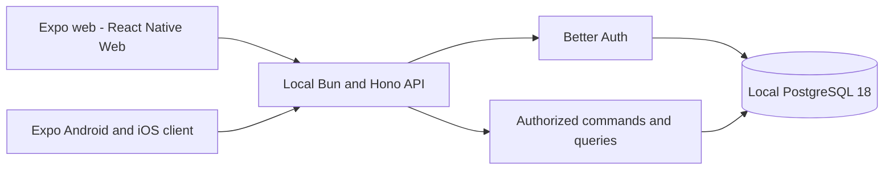

# Architecture

## Goals

Pisto Stack keeps one TypeScript codebase while preserving hard trust boundaries between a public
client, an internet-facing API, provider integrations, and durable data. The design favors explicit
contracts, small provider adapters, reversible releases, and access decisions that remain valid when
billing events are delayed or duplicated.

## Current runtime diagram


```mermaid
flowchart LR
  Web[Expo web - React Native Web]
  Native[Expo Android and iOS client]
  API[Local Bun and Hono API]
  Auth[Better Auth]
  Domain[Authorized commands and queries]
  DB[(Local PostgreSQL 18)]
  Web --> API
  Native --> API
  API --> Auth
  API --> Domain
  Auth --> DB
  Domain --> DB
```

Shared React Native components are styled through Tailwind and free Uniwind. Native and web have
separate rendering/runtime behavior; shared source and successful bundles do not establish device
acceptance. See [the frontend guide](frontend-expo-ui.md).

Billing adapters exist but are disabled in the local environment. Native purchase integration,
AI/voice, queues and user-object storage are not running parts of this diagram. Their exact status
and prerequisites live in [the capability matrix](production-capabilities.md). The API owns access;
a client assertion or cached provider response is never authorization.

## Workspace boundaries

| Workspace | Owns | Must not own |
| --- | --- | --- |
| `@pisto/app` | Expo Router screens, platform UI, public API client, device adapters | Provider secrets, SQL, server authorization |
| `@pisto/api` | Hono composition, middleware, route handlers, health endpoints | Database schema or provider-specific access rules |
| `@pisto/contracts` | Transport-neutral request/response schemas and public types | Runtime I/O or provider SDK clients |
| `@pisto/db` | Drizzle schema, migrations, repositories, transaction helpers | HTTP or UI concerns |
| `@pisto/auth` | Better Auth configuration, session access, auth schema integration | Product catalog or UI navigation |
| `@pisto/billing` | Provider adapters, webhook normalization, entitlement resolution | React components or HTTP framework composition |

Dependencies point inward toward contracts and domain packages. The API composes packages; packages
do not import the API. The app may import public contracts, but never server implementations.

The implemented domain commands, queries, and audit live in `packages/db`, with public money and
transport rules in `packages/contracts`. They do not depend on AI SDK, Hono, or React. A future
assistant boundary will own prompt versions, provider/model selection, narrow tools, and bounded
orchestration without owning SQL or business rules. The API remains the composition root. See
[AI assistant architecture](ai-assistant.md); no assistant package or capability exists today, and
an additional sales package is not required merely to expose existing commands to a future tool.

All later product domains follow the capability slice contract in
[Product capability architecture](product-capability-architecture.md) and
[ADR 0011](adrs/0011-modular-capabilities-and-app-owned-composition.md). This remains a modular
monolith: applications compose explicit routes, commands, queries, tools, and platform adapters.
A capability earns a focused package, asynchronous boundary, or service only from demonstrated
ownership, consumer, scale, reliability, or deployment pressure.

## Product modularity and business-owned settings

Pisto isolates change by business capability, not by creating a service or generic abstraction for
every screen. An implemented capability follows the same explicit path:

```text
Expo route
  -> capability-owned screen and draft state
  -> public transport contract
  -> authenticated Hono route
  -> capability-owned command/query
  -> PostgreSQL transaction and canonical record
```

The route is composition only. Business validation does not live in React components, HTTP handlers,
AI prompts, or provider adapters. Cross-capability writes use a named owner port and one explicit
transaction; they do not update another module's tables directly. The concrete directory ownership
and dependency direction are normative in
[Product capability architecture](product-capability-architecture.md#current-physical-composition).

Currency and time-zone configuration belong to each business:

- the user enters a supported ISO 4217 currency and IANA time zone during business creation;
- there is no deployment-wide, device-derived, session-derived, or provider-derived currency;
- the server resolves and freezes the currency's minor-unit digits instead of trusting a client;
- every persisted money record snapshots its currency and exponent, and relevant records snapshot
  their confirmed local date, local minute, time zone, and resolved instant; and
- new modules reuse the public money/time primitives and fresh `business_settings` policy without a
  mutable global `currentCurrency` or duplicated defaults.

V1 deliberately blocks an operating-currency change after financial history exists. A future
currency transition is a separate data migration and product decision with an effective instant;
it cannot rewrite old records or silently convert amounts. This protects module independence and
historical meaning while still allowing different businesses in the same deployment to choose
different currencies. See
[ADR 0015](adrs/0015-business-owned-currency-and-money-snapshots.md).

Typical changes stay inside these boundaries:

| Change | Expected owner and impact |
| --- | --- |
| Add or change one business workflow | Its contract, persistence owner, API adapter, feature UI, and thin route |
| Add a module to Operate | The completed module plus the explicit authorized navigation map; no self-registration |
| Change an AI, billing, speech, or storage provider | Its edge adapter and configuration; canonical domain records do not change |
| Change presentation locale or responsive layout | Typed resources, formatters, tokens, or a real platform adapter; stored money does not change |
| Compose one atomic cross-module operation | One application transaction through named owner ports, with rollback and replay tests |
| Change operating-currency policy | A dedicated ADR, migration, compatibility plan, and multi-capability integrity tests |

One Pisto business workspace uses one Better Auth organization identifier as its `businessId`.
Organization/session state selects a candidate workspace; the API reloads membership and applies
Pisto action policy before every domain operation. Typed business settings and financial records stay
in Pisto-owned tables rather than auth metadata. See
[ADR 0010](adrs/0010-organization-backed-business-tenancy.md).

## Core flows

### Authenticated API request

1. The client sends its Better Auth session using the platform-appropriate cookie mechanism.
2. Hono applies request ID, logging, secure headers, CORS, and body-size controls.
3. Better Auth resolves the session at `/api/auth/*` or an API auth guard resolves it for `/v1/*`.
4. Product middleware charges a server-resolved user budget in PostgreSQL and rejects business
   writes when `PRODUCT_WRITES_ENABLED=false`; account/provider endpoints retain separate policy.
5. The route validates input using shared contracts, and the repository rechecks the live session,
   membership, and action permission before bounded database work.
6. The API returns a typed response without internal exceptions, credentials, or provider payloads.

### Sale and report

The structured total-only path through onboarding, review, confirmation, canonical result,
previous-month summary, and transactional void/replacement correction is implemented in
[Sales](sales.md). The bounded `GET /v1/sales` history exposes past sales and
correction actions in `/operate/sales`. `GET /v1/reports/operating` supplies `/operate/reports` with
exact period flows and current positions from one authorized read-only repeatable-read transaction.
New-sale preparation is persisted separately from the sale. Explicit confirmation commits the
sale, receipt and recoverable result atomically, under
[ADR 0018](adrs/0018-durable-sale-review.md). Unreviewed inputs and other financial editors retain
their separate recovery limits. There is no client-side financial outbox or automatic write replay.

The conversational target is approved but unimplemented; see [the AI guide](ai-assistant.md) only for
that work. A model proposes a draft or selects a narrow authorized read, never owns accounting rules
or silently commits. Voice later supplies editable text to the same flow.

### Web purchase when configured

This flow requires explicitly configured Polar products and credentials; local billing is disabled.

1. An authenticated browser requests an allowed product from `/v1/billing/checkout`.
2. The server maps the internal product to an allowlisted Polar product and creates or selects a web
   checkout. The browser does not supply a trusted price or arbitrary product ID.
   Direct Better Auth provider checkout/customer paths are denied at the Hono edge; only the `/v1`
   wrappers invoke those adapter endpoints internally after subject/scope validation.
3. Polar completes payment in the browser.
4. A signed Polar webhook updates provider state idempotently.
5. The billing domain recomputes the internal entitlement and the current return screen refreshes
   `/v1/billing/entitlements`. `/v1/billing/state` remains available when a client also needs the
   normalized provider customer state.

### Native purchase (release-gated integration seam)

The baseline native adapter is disabled and the RevenueCat React Native SDK is not installed. Once
the native release gate in the billing documentation is complete, the intended flow is:

1. The native app requests offerings from RevenueCat and invokes Apple or Google native purchase UI.
2. RevenueCat validates store transactions and exposes active native entitlements.
3. The app immediately refreshes its UI from `CustomerInfo`, but server-controlled features still
   consult the API entitlement.
4. An authenticated RevenueCat webhook updates the backend projection. Restore uses the same stable,
   non-guessable application user ID as the authenticated Pisto user.

See [Billing and entitlements](billing-entitlements.md) for the normative rules and current policy
qualification.

## Runtime topology

Local Expo and Bun/Hono processes use Docker PostgreSQL. The configured desktop ports and fresh
checkout workflow are in [getting started](getting-started.md). Source publication to GitHub is
separate from cloud provisioning, hosting or store submission; none is implied by a source push.

The portable API container and Expo web export are separate artifacts. Secrets stay in private
server configuration, migrations use a separately authorized connection, and pools remain bounded.
`infra/gcp` contains inactive reference scripts still checked by credential-free CI, not a selected
runtime or deployment work order. No queue or user-object adapter is implemented.

The API keeps no authoritative host-local state between requests. See
[ADR 0017](adrs/0017-portable-postgres-and-hosting.md),
[local runtime and portable artifacts](web-deployment.md), and [release evidence](release-evidence.md).

## Reliability invariants

- `/health` proves that the process is running; `/ready` proves that required dependencies are ready.
- Readiness does not create schema, seed data, or external provider objects.
- Database readiness and shutdown work have explicit bounds. Add explicit deadlines and reviewed,
  bounded retry behavior before relying on any provider/client network call in production; mutating
  retries require idempotency. The baseline does not claim one universal HTTP deadline policy.
- A webhook is acknowledged only after durable receipt or completed idempotent processing.
- Provider event time/version decides ordering; HTTP arrival time does not.
- Cancellation and expiration are distinct: cancellation can leave access active until period end.
- A provider-specific revocation removes only that provider grant. Another valid source may continue
  to satisfy the same entitlement.
- Model output, retrieved content, and transcripts are untrusted. Every business mutation repeats
  server authorization and deterministic validation and is idempotent and auditable.
- PostgreSQL is authoritative for transactional facts. RAG, vector search, and graphs do not replace
  domain queries or financial records.
- Shared product budgets use an atomic PostgreSQL upsert and fail closed when the store fails. Their
  60-second window must remain compatible with Better Auth's cleanup of the shared `rateLimit` table.
- Command locks follow session, membership, then idempotency key across capabilities. The
  [data model](data-model.md) records the database invariants and exact cursor/read-snapshot rules.

## Official sources

- [Expo Router introduction](https://docs.expo.dev/router/introduction/)
- [Hono on Bun](https://hono.dev/docs/getting-started/bun)
- [Better Auth with Hono](https://better-auth.com/docs/integrations/hono)
- [Vercel AI SDK 7](https://vercel.com/changelog/ai-sdk-7)
- [Vercel AI SDK provider management](https://ai-sdk.dev/docs/ai-sdk-core/provider-management)
