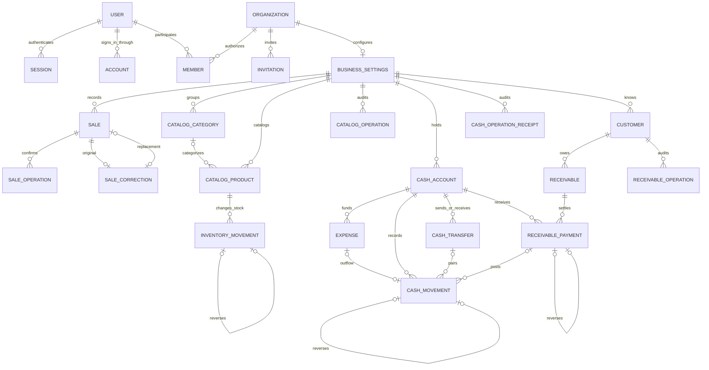

# Pisto relational data model

## September 26 addition: sale review recovery

Migration `0006` adds `sale_review`. Each actor/business can have one open working command snapshot,
not an additional ledger or aggregate. The review freezes currency, exponent, and time zone and
retains the original confirmation UUID. Posting writes `sale`, `sale_operation`, and the review's
`sale_id` in the same transaction. The composite sale foreign key prevents cross-business links.

The JSONB command is a strict, bounded transport snapshot validated on write and read; canonical
money remains in normalized sale columns. Closing clears this payload and retains minimal key/owner
metadata to reject delayed retries. A saved result is not closed until its exact sale ID is
acknowledged. See [ADR 0018](adrs/0018-durable-sale-review.md) for ownership, retention, and failure
semantics. The earlier table inventory below describes the September 10 baseline.

## September 10 baseline

Reviewed against the implementation on 2026-09-10. This document describes persisted behavior,
intentional snapshots, and the next bounded changes. It does not imply that a database has been
provisioned, migrated, backed up, or released.

## Design decision

Keep the existing PostgreSQL model and improve its demonstrated integrity and query defects.
The current schema has 29 tables: eight authentication tables, four billing projections/receipts,
and seventeen business tables. Reference entities, financial records, movements, and command
receipts already have distinct owners. Replacing them with a generic transaction/document table,
JSON business records, a graph, or a second membership system would weaken those boundaries.

The canonical master entities follow relational normalization: one organization owns identity,
one business settings row owns operating settings, one customer owns contact details, and one
catalog product owns its current description and quantity policy. Historical money/time snapshots
and exact command-result snapshots are intentional duplication with separate meanings. Calling
every table strictly third normal form would conceal those deliberate historical dependencies.

## Relationship map

The diagram omits scalar fields, most actor links, and repetitive receipt edges for readability.
Every business-owned relationship includes `business_id` in its foreign key where applicable.

Authentication verification and rate-limit rows are provider-owned support records. Billing
customers, subscriptions, webhook receipts, and entitlements are separate from the operating core.
An entitlement has exactly one user or organization subject and is never a substitute for business
membership authorization.

## Ownership and authoritative values

| Records | Authoritative values | Derived values or deliberate snapshots |
| --- | --- | --- |
| `organization`, `member`, `session` | Workspace identity, exact membership role, session expiry and selected workspace | Effective Pisto permissions come from the static server policy |
| `business_settings` | One confirmed currency/exponent and business IANA zone | Device locale is display only |
| `sale`, `sale_correction`, `sale_operation` | Posted total-only sale, correction relationship/reason, actor and command identity | Monthly gross/count/average are queries; currency/local wall time are immutable evidence |
| `catalog_category`, `catalog_product` | Current names, SKU, unit, precision, tracking/archival policy, optional selling price | Stock is never a writable product column |
| `inventory_movement` | Signed exact quantity delta and one reversal link | On-hand quantity is the sum of deltas; low stock compares that sum with the product threshold |
| `cash_account`, `expense`, `cash_transfer` | Account policy, paid expense, transfer identity and selected endpoints | Account balance is never stored on the account |
| `cash_movement` | Exact signed movement, source link, account, actor and time | Cash balance is the sum of deltas; transfer legs cancel at business level |
| `customer`, `receivable` | Contact details, original debt, due date, posted/voided authority state | Open/paid/overdue and customer balances are derived |
| `receivable_payment` | Applied payment or reversal, original amount and account relationship | Paid = payments minus reversals; outstanding = original minus paid for a posted charge |
| Capability operation receipts | Business/actor/key/action fingerprint and the recorded command result | JSON snapshots support exact replay; they do not own current balances or permissions |
| Billing receipts/projections | Verified event evidence and normalized provider state | Effective access checks status, time validity, subject, and recognized source |

Money crosses JSON as canonical integer strings and is stored as PostgreSQL `bigint`. Aggregate
`sum(bigint)` uses PostgreSQL `numeric`, then returns decimal strings without floating-point
conversion. Stock uses integer quantities plus an explicit precision. Currency/exponent snapshots
remain bound to the create-once business currency by composite foreign keys. Future currency
changes require a new effective-date design; they must not rewrite old facts.

`occurred_at` is an instant. Confirmed local date/minute and time zone retain what the user reviewed.
`created_at` orders receipt history independently of the operation's occurrence time. PostgreSQL
retains microseconds, so pagination must serialize the original timestamp as exact UTC text and
compare it as `timestamptz`; JavaScript `Date` is appropriate only for display timestamps.

## Integrity, permissions, and transactions

Business identity is resolved from an unexpired server session, then checked against fresh exact
membership and named permissions. Onboarding and business discovery also check a live session,
including before returning a replay. No client-supplied role, actor, business identifier, cached
permission list, transcript, or model response authorizes a command.

Command transactions acquire locks in this order: session, business membership/settings, command
key, then the resources the operation changes. All capabilities use the same authorization-before-key
order. Sales keep separate replay composition because sale posting and sale correction share one
key space across two receipt tables. Cash, catalog, and receivables each own their receipt table.
An advisory lock alone is not authorization, and an idempotency key alone is not proof of matching
input: the stored fingerprint and action must match.

Account and product row locks serialize balance-changing operations. Transfers lock both accounts
in identifier order. Receivable payments lock the charge and apply its remaining-balance policy.
Cash owns the internal port that writes matching payment cash movements in that same transaction.
Network/provider calls do not belong inside these transactions.

Database constraints enforce positive amounts, permitted states and action shapes, one reversal,
case-insensitive tenant-scoped names/SKUs, and same-business relationships. Composite foreign keys
also bind payments to their receivable and customer. Some invariants require more than a row check:
exact transfer pairs, opposite reversal amounts, available stock/funds, and complete audit writes
are enforced by the owning command transaction and tested against PostgreSQL. Do not describe
these as database-only guarantees.

Migration `0005_require_complete_record_snapshots.sql` strengthens three existing checks: optional
catalog price snapshots must be entirely absent or entirely present, and voided expenses/receivables
must have a reason. Explicit null guards matter because PostgreSQL accepts an unknown result from
a `CHECK`. The migration validates existing rows and fails if malformed records need repair; it does
not fabricate money or reasons. Replacing these constraints requires table locks and validation scans,
so schedule the migration according to the actual table sizes and release window.

The application exposes append-only financial histories, but the schema does not install a blanket
trigger prohibiting administrator updates/deletes. Production should use a restricted runtime role
and a separate migration role, with explicit repair and retention procedures. RLS is not currently
the tenant authorization mechanism; adding it would require transaction-local tenant context,
pooling compatibility, fail-closed policies, and a dedicated migration/security review.

## Read models and indexes

Use explicit tenant-scoped repository queries as the current read models. Static SQL views would
not remove the need to authorize each request and would not make multiple statements share a
snapshot. Customer detail, receivable detail, and the operating report use read-only repeatable-read
transactions so related facts describe one committed database snapshot. Single-statement totals
remain appropriate under the default isolation level.

Sales and expenses use half-open occurrence-time periods in the business zone. Operating reports
explicitly separate selected-period sales/expenses/cash from current inventory and receivable
positions. A report must not call gross revenue profit or treat internal transfers as external income.

Existing indexes lead with tenant identity, then relevant status/account/customer/product filters
and deterministic ordering columns. Sales include both business-created and
business-status-created indexes. Cash movements are indexed by business/account/creation and by
business/occurrence. Receivables have customer/history and status/due-date paths; unique operation
keys support exact replay.

Before adding an index or materialized balance, measure the actual authorized query with
`EXPLAIN (ANALYZE, BUFFERS)` on representative data. In particular, unfiltered cash history and
catalog history should be measured as businesses grow. A materialized balance would introduce a
second maintained value, reconciliation, and recovery obligations; current evidence does not justify
that change. No generic read-model package, background projection worker, or materialized view is
added by this audit.

## Local PostgreSQL and portability

The active runtime and tests use local PostgreSQL 18. The owner's latest instruction is local-only;
Neon is an optional future database preference, not the selected runtime. Keep postgres-js and
Drizzle as the runtime/schema boundary. The domain depends on PostgreSQL transactions, constraints,
SQL, and transaction-scoped advisory locks, not a Neon SDK, HTTP database API, branch API, or identity
service. [ADR 0017](adrs/0017-portable-postgres-and-hosting.md) records the corrected scope.

Committed SQL migrations and standard PostgreSQL backup/restore preserve the exit path. Local
migrations use a direct local endpoint and tests must verify the target before mutating it. Any
future shared database requires a separate runtime connection with TLS and a bounded pool, tested
pooler behavior, restore evidence, and reviewed timeouts/connection budgets. Provider projects,
branches, and credentials remain operational configuration; provider IDs do not enter canonical
business tables. The prior Neon-to-local restore is historical portability evidence in
[Release evidence](release-evidence.md), not authorization to use Neon for current work.

## Next bounded changes and unresolved rules

No wholesale table replacement or speculative schema is approved by this document. Future changes
must preserve current records through additive migrations, explicit backfills, validation, and only
then removal of superseded fields.

| Trigger | Smallest next decision or migration |
| --- | --- |
| Itemized sale and automatic inventory deduction approved | Add sale lines with confirmed quantity/price snapshots and an optional same-business catalog reference; use a cash/inventory owner port where one command must commit effects atomically; retain total-only history |
| Date fields gain further direct SQL consumers | Evaluate a forward conversion of date-only text columns to native `date` with an invalid-value preflight; do not guess invalid historical dates |
| Currency transition approved | Add effective-dated settings and explicit reporting boundaries before loosening current composite currency constraints |
| Team administration approved | Reuse organization memberships; specify invitation delivery, role transitions, and last-owner protection before exposing provider management endpoints |
| Customer archival followed by payment reversal | Current policy permits reversal after archival but denies new payment to an archived customer. Reversal can reopen uncollectable debt in the product. Decide explicit reactivation or settlement permission; do not silently erase or void debt |
| Cash account archival followed by receivable payment correction | Current cash port requires an active account for payment reversal; an archived account can therefore block correction. Decide restoration or a documented archived-account correction policy |
| Billing product change changes entitlement key | Reconcile grants for the whole subscription, retire superseded keys, and reject stale events before paid feature gates are enabled |

## Validation and primary sources

`packages/db/integration/data-hardening.integration.ts` covers expired onboarding/discovery, a
controlled cross-capability command-key race, lossless pagination through same-microsecond rows,
and customer detail consistency during a real concurrent commit. Existing domain suites cover
tenant denial, money/quantity rules, reversals, exact replay, and rollback. These are local validation
gates, separate from managed-database migration, restore, load, and release evidence.

Reviewed 2026-09-10; recheck these sources when changing time precision, isolation, lock strategy,
schema integrity, or managed PostgreSQL connection behavior:

- [PostgreSQL date/time precision](https://www.postgresql.org/docs/18/datatype-datetime.html)
- [PostgreSQL transaction isolation](https://www.postgresql.org/docs/18/transaction-iso.html)
- [PostgreSQL row and advisory locks](https://www.postgresql.org/docs/18/explicit-locking.html)
- [PostgreSQL constraints](https://www.postgresql.org/docs/18/ddl-constraints.html)
- [Neon connection pooling](https://neon.com/docs/connect/connection-pooling)
- [Neon PostgreSQL compatibility](https://neon.com/docs/reference/compatibility)
- [Existing migration policy](database-drizzle.md)
- [Money snapshot decision](adrs/0015-business-owned-currency-and-money-snapshots.md)
- [Cross-capability transaction ownership](adrs/0016-owner-ports-for-cross-capability-transactions.md)
